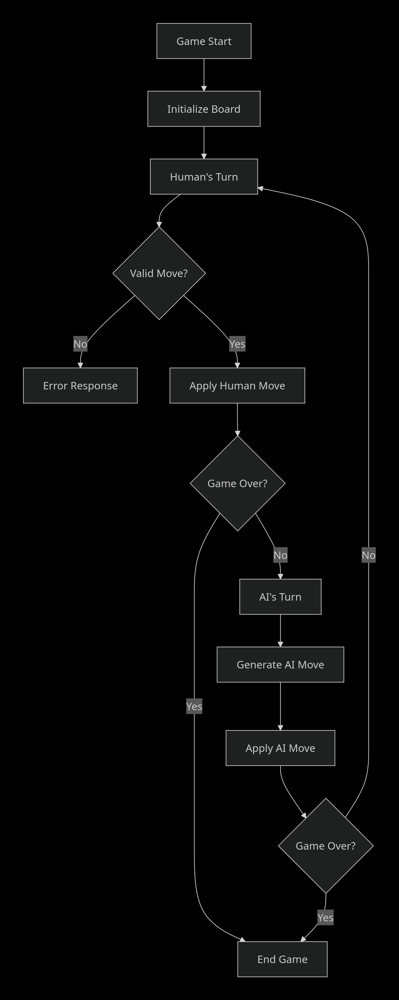
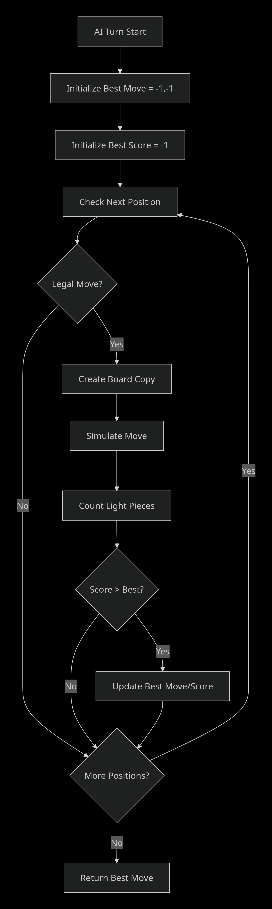

# Othello/Reversi  

# Table of Contents
1. [Overview](#overview)
2. [How the game works](#how the game works)
3. [Third Example](#initialising flask)
4. [User input](#user input)

## Overview
This project is a python implementation of the game Othello/Reversi. It is a server backend for a html template which takes input from the user as coordinates on
the board.  The human player has control over the dark counters.These coordinates are then checked and validated. The server checks if the game is over, and if 
not, generates coordinates from an artifical intelligence, which decides the move for light.

## How the game works

### Initialising flask
When you first visit the website or refresh the page, the `initialise_flask()` function runs.

This function initialises flask and the game state. If the user refreshes the page, this function runs again.

The move counter is initialised to 60, as there can be 60 total moves in Othello. The `counter` variable could be used to check if the game is over, as if counter is 0, then there are no more moves, but in this case the `move_is_available` function works for checking if neither player can move, so there is no need to check if `counter` is 0.

`board` is initialised according to the `initialise board` function, which returns an 8x8 2D array representing the starting position of an Othello board.

Finally, we return the template from the function `render_template`. This is a flask function. It looks for a folder called 'templates' and also takes in any arguments that are required by the html. In my index.html, there is a variable for the game board which comes from flask, so it is passed as an argument to this function. This allows the website to render the board.

### User input

#### Getting user input
The `get_move` function handles user input. When the user clicks on a square, they are taken to the `/move` route. First, we capture the user's click as a set of coordinates, using `request`. This input is validated to check for errors, and if it is invalid then we return a fail json. 

 

#### Checking the input is a legal move
We then check that the move is legal using the `legal_move` function. This function works by checking all the squares around the square defined by the coordinates we pass as an argument. If the square is empty, and we find an opponent counter next to the square, we store the direction of the opponent counter and begin iterating through the `board` array in that direction until we find a counter which is the same colour as the player moving. If we find this, then the move is legal, otherwise we return `False`. Python allows for negative indices so we have to raise an `IndexError` if we go negatively out of bounds. We break if we are out of bounds when searching for an ally piece, but pass if we are searching for an opponent piece, as we want to check all directions.
 
If `legal_move` returns `False`, we again return a fail json. If not, we update the board with the `swap_colours` function.

 

#### Updating the board
The `swap_colours` function works similarly to `legal_move`, however this time we do not stop after finding an opponent counter in one direction. We check each direction for an opponent counter, and then iterate until we find an ally counter. We store this direction as a tuple in the `directions_to_go_in` list, and after each direction has been checked, we store each coordinate that holds an opponent counter we want to swap as tuples in the `squares_to_change` list.  We then change each element in the board according to the coordinates we have stored in the `squares_to_change` list to be the `colour` variable, which is the ally colour. We return the new board state, and decrement the counter by 1.

#### Checking for game over
We now check if there are any available moves for the AI. If there are not, we check if there are any moves left for the human player. If there are, return a success json, which updates the webpage with the new board state. This allows the human player to then make another move. If the human player has no moves, then the `game_over` function is called which calculates the winner based on the output of the `count_counters` function. We then output the result of the game to the console. 

#### The AI move
If the AI does have a move available, we update the board using coordinates generated from the `ai` function. This function takes the current board as an argument and returns coordinates as a tuple. We initialise the variables `best_score` and `best_move`. We create a copy of the board (using deepcopy as the board is a 2D array) and checks each square to see if moving there is legal. If it finds a legal move, it then updates the copied board using `swap_colours` and checks how many light counters are on the board after this move using `count_counters`. If the number of light counters is greater than the value for `best_score`, we updated `best_score` and store the coordinates of the move as `best_move`. After we have checked every square to find the move that gets the most light counters on the board, we return the move as a tuple. 

We then check if the human player can move after the AI move, if they cannot, we prompt the AI to move again. If neither colour can move, the game ends. If the human player can move, we then finally return the state of the board with a success json. 

 

